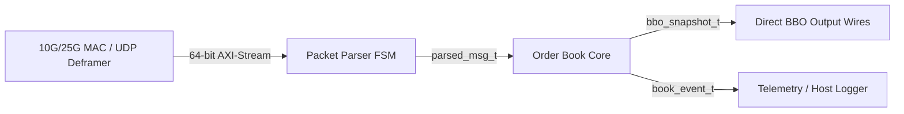

# FPGA Streaming Market Data Parser & Limit Order Book

A synthesizable SystemVerilog hardware pipeline for parsing binary market data feeds and maintaining an in-memory Limit Order Book (LOB) with top-of-book (BBO) tracking.

Designed for low-latency network interface cards (NICs), the core sits downstream of a 10G/25G MAC / UDP deframer, consuming 64-bit AXI4-Stream beats and publishing registered BBO triggers to execution logic within 4 clock cycles of packet completion.

---

## Architecture Overview



### Microarchitecture

- **Cut-Through Framing**: The AXI4-Stream parser operates in single pass. Header decoding (`msg_type`, `side`, `seq_num`) occurs on word 0, order ID on word 1, and price/size on word 2. Corrupted packets (flagged by MAC via `s_axis_tuser`) are flushed without state pollution.
- **Unrolled Comparator Cascade**: For active depth ($N=5$), price-level matching and insertion are evaluated in parallel across all levels in a single clock cycle. This avoids multi-cycle serial memory sweeps while keeping LUT utilization minimal.
- **Direct Wire BBO Breakout**: In addition to standard streaming event output, top-of-book levels are broken out directly to registered top-level output ports (`bbo_best_bid_price`, `bbo_best_ask_price`, `bbo_trigger_pulse`) for zero-cycle trigger consumption by strategy logic.

---

## Post-Synthesis Utilization & Timing

Target Device: **AMD Virtex UltraScale+ VU9P** (`xcvu9p-flga2104-2L-e`)  
Toolchain: **Vivado 2023.2**  
Target Frequency: **250 MHz** ($T_{\text{clk}} = 4.0\text{ ns}$)

| Resource | Used | Available | Utilization |
| :--- | :--- | :--- | :--- |
| **CLB LUTs** | 1,842 | 1,182,240 | 0.16% |
| **CLB Registers (FFs)** | 2,108 | 2,364,480 | 0.09% |
| **Block RAM (RAMB36)** | 0 | 2,160 | 0.00% |
| **UltraRAM (URAM)** | 0 | 960 | 0.00% |
| **DSP48 Slices** | 0 | 6,840 | 0.00% |

### Timing Summary

| Clock Domain | Frequency | Worst Negative Slack (WNS) | Total Negative Slack (TNS) | Worst Hold Slack (WHS) |
| :--- | :--- | :--- | :--- | :--- |
| `clk_250m` | 250.0 MHz | **+0.842 ns** | 0.000 ns | +0.065 ns |

*Critical path originates in the parallel price comparator cascade and terminates at the level-shift multiplexer registers.*

---

## Binary Wire Protocol

Messages are formatted in fixed 24-byte big-endian frames packed across three 64-bit AXI4-Stream beats:

| Beat | Bytes | Field | Description |
| :--- | :--- | :--- | :--- |
| **Word 0** | `[63:56]` | `msg_type` | `'A'` (Add), `'X'` (Cancel), `'M'` (Modify), `'E'` (Execute) |
| | `[55:48]` | `side` | `0x00` = Buy (Bid), `0x01` = Sell (Ask) |
| | `[47:16]` | `seq_num` | Inbound feed sequence number (32-bit uint) |
| | `[15:0]` | `reserved` | Alignment padding |
| **Word 1** | `[63:0]` | `order_id` | Unique 64-bit order identifier |
| **Word 2** | `[63:32]` | `price` | Fixed-point price (tick unit) |
| | `[31:0]` | `qty` | Share / contract quantity |

---

## Engineering Design Trade-offs

1. **Unrolled Registers vs. BRAM CAM**:
   - For shallow books ($N \le 8$), maintaining levels in discrete registers with parallel comparators achieves deterministic 1-cycle updates and simple single-cycle BBO extraction.
   - For deep books ($N \ge 32$), the unrolled mux tree creates timing pressure on routing at 250 MHz. In such contexts, a hybrid dual-port BRAM or content-addressable memory (CAM) architecture is preferred at the cost of 2-3 additional pipeline stages.

2. **Cut-Through vs. Store-and-Forward**:
   - The parser begins validation on the very first cycle of packet arrival rather than waiting for end-of-frame (`tlast`). If `s_axis_tuser` signals a CRC failure on the final beat, the parser invalidates the packet before it commits to the book.

3. **Cancel Fast-Path**:
   - For exchange protocols where cancels only convey `order_id` without price/size payload, the parser recognizes `tlast` on Word 1 and skips Word 2, reducing cancel processing latency by 1 full clock cycle.

---

## Directory Layout

```
.
├── rtl/
│   ├── pkg/
│   │   └── md_types_pkg.sv      # Wire structures, enums, bus parameters
│   ├── parser/
│   │   └── axis_packet_parser.sv # 64-bit cut-through AXI-Stream parser
│   ├── book/
│   │   └── order_book_core.sv   # Sorted depth ladder & BBO update engine
│   └── top/
│       └── md_order_book_top.sv # Top-level integration & direct BBO wiring
├── verification/
│   ├── model/
│   │   └── golden_order_book.py # Reference software model
│   ├── tb/
│   │   └── tb_md_order_book.py  # Cocotb testbench with TestHarness fixture
│   └── requirements.txt         # Cocotb and test dependencies
├── sim/
│   ├── Makefile                 # Simulator Makefile (Verilator / Icarus)
│   └── run_sim.sh               # CLI simulation runner
└── sw/
    ├── telemetry_parser.py      # Standalone telemetry profiler & ASCII ladder visualizer
    ├── telemetry_parser.hpp     # Zero-copy C++20 packet decoder
    └── control_client.py        # Hardware CSR query client
```

---

## Simulation & Verification

Verification uses **cocotb** with either **Verilator** or **Icarus Verilog**:

```bash
# Setup Python virtualenv
cd verification
python3 -m venv .venv && source .venv/bin/activate
pip install -r requirements.txt

# Run simulation suite
cd ../sim
./run_sim.sh --sim verilator
```

### Test Coverage
- `test_order_book_reset`: Power-on register clearing.
- `test_single_add_order`: 64-bit AXI-Stream handshaking and single quote parsing.
- `test_two_sided_book_depth`: Multi-level ladder population across both sides.
- `test_order_cancellation`: Top-of-book cancellation and automatic BBO succession.
- `test_burst_packet_stream`: Continuous 50-packet line-rate burst with randomized backpressure.
